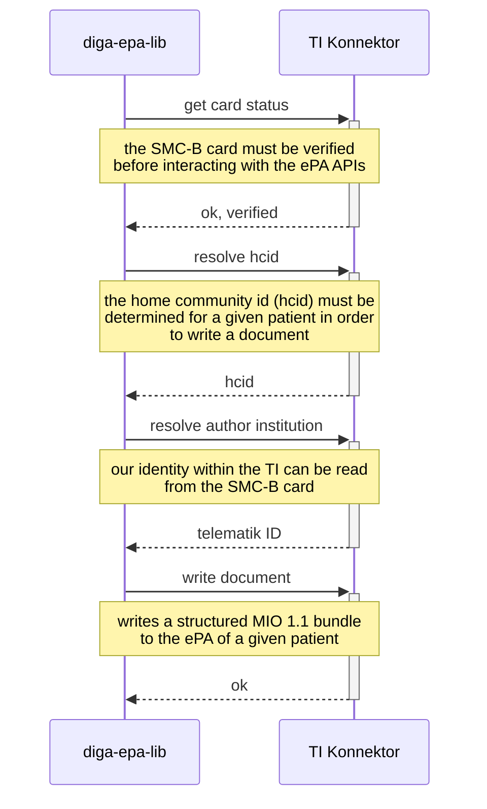

# Electronic Health Record (ePA) Library for DiGA Use Cases

This library interacts with the Telematik-Infrastuktur (TI) via a Konnektor to write structured HL7/FHIR bundles for
DiGA treatments into the electronic health record (ePA).


## Pre-requisites

1. Access to a TI Konnektor, e.g. from RISE
2. A valid Secure Module Card for your Institution (SMC-B)
3. A card terminal paired with the Konnektor
4. TLS Client certificate to authenticate the application to the Konnektor

**NOTE:** All of the above you can get from e.g. [RISE](https://rise-konnektor.de/)

## Overview Integration
See [KonnektorServiceAcceptanceTest](./diga-epa-client/src/test/java/com/oviva/epa/client/KonnektorServiceAcceptanceTest.java).


## Usage
### Maven Dependency
1. [Setup Maven Settings for GitHub packages](https://docs.github.com/en/packages/working-with-a-github-packages-registry/working-with-the-apache-maven-registry#installing-a-package)
2. Add the [ePA Client Library](https://github.com/oviva-ag/diga-epa-lib/packages/2098135)
   ```xml
   <dependency>
     <groupId>com.oviva.epa</groupId>
     <artifactId>diga-epa-client</artifactId>
     <version>${version}</version>
   </dependency>
   ```
3. See [KonnektorServiceAcceptanceTest](./diga-epa-client/src/test/java/com/oviva/epa/client/KonnektorServiceAcceptanceTest.java) on how to initialise the client.
   

## Developing the Library
1. Copy the required keystore received with the Konnektor
    ```shell
    cp vKon_Client_*.p12 ./diga-epa-client/src/main/resources/keys
    ```
2. Run the tests in the [KonnektorServiceAcceptanceTest](./diga-epa-client/src/test/java/com/oviva/epa/client/KonnektorServiceAcceptanceTest.java) class
   * You should be able to write an example file in the test environment (RU).

## Normative Documents
- [DiGA Leitfaden, 3.5 Interoperabilität](https://www.bfarm.de/SharedDocs/Downloads/DE/Medizinprodukte/diga_leitfaden.html)
- [DiGA Anwendungssteckbrief](https://gemspec.gematik.de/docs/gemAnw/gemAnw_DiGA/latest/)
- [gematik/api-telematik](https://github.com/gematik/api-telematik/tree/OPB5)
- [gematik/api-ePA](https://github.com/gematik/api-ePA/tree/ePA-2.6)
- [MIO DiGA Toolkit v1.1](https://mio.kbv.de/display/DIGA1X1X0)

## Links
- [Gematik epa-ps-sim](https://github.com/gematik/epa-ps-sim) - The basis for this project.
- [Gematik Confluence](https://wiki.gematik.de/pages/viewpage.action?pageId=512716463#TILeitfadenf%C3%BCrDiGAHersteller-SchreibeneinesDiGA-MIOs/PDFindieePAdesNutzers)
- [Gematik FAQ](https://wiki.gematik.de/display/TFD/FAQ)
- [RISE Konnektor](https://rise-konnektor.de/)

## Wishlist
- `health` check on `KonnektorConnection`
